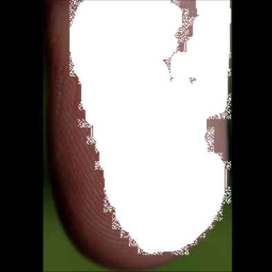

# Fake_Fingerprint_Generation (적대적 생성 모델을 활용한 사용자 생체 정보 보안 프로그램)

## 개발 배경

생체 인식을 통한 보안 방식이 시스템의 주류로 활용됨에 따라 보안에 대한 우려의 목소리가 증가하고 있다. 생체 인식의 경우 생체 정보가 변경할 수 없는 정보이기 때문에 정보의 보안이 매우 중요한 문제라고 할 수 있다. 또한 기술의 발전에 의하여 사진에서 개인의 정보를 추출하는 것은 더 이상 어려운 문제가 아니다. 실제로 사진을 통하여 정치인의 지문을 추출하거나, SNS에 업로드된 손가락 사진을 통하여 범죄자를 잡는 등의 사건들은 우리의 개인정보가 더 이상 안전하지 않다는 것을 보여준다.

하지만 지문을 왜곡, 혹은 모자이크와 같은 방식으로 처리하는 것은 사진에 이질감을 주어 퀄리티를 떨어뜨릴 수 있어 좋은 방식이 아니라고 생각되었다. 그렇기에 우리 팀은 적대적 생성 모델(GAN)을 활용하여 사진의 질을 훼손하지 않으며 생체 인식 보안 문제를 해결할 수 있는 프로그램을 제안하고자 한다. 

## 팀원 정보

[팀원정보](https://github.com/CUAI-CAU/Fake_Fingerprint_Generation/tree/main/MD/팀원정보.md)

# 최종 결과물

[Presentation](https://github.com/CUAI-CAU/Fake_Fingerprint_Generation/tree/main/Final/presentation.mp4) | [Paper](https://github.com/CUAI-CAU/Fake_Fingerprint_Generation/tree/main/Final/FakeFingerPrintGeneration_paper.docx) | [PPT](https://github.com/CUAI-CAU/Fake_Fingerprint_Generation/tree/main/Final/CUAI-최종-발표.pptx)

# Model
-----------------------------------------------------------------------------------------------------------------
## 모델 Pipeline

  

## Fingerprint Inpainting result

### 전체 과정

  
  
  
  

---------------------------------------------------------------------------------
### Original Image

### Mask

### Fingerprint Edge

### Inpainting Result

# 진행상황

[06-22(주제 선정)](https://github.com/CUAI-CAU/Fake_Fingerprint_Generation/tree/main/MD/06-22.md)

[06-29(데이터 수집)](https://github.com/CUAI-CAU/Fake_Fingerprint_Generation/tree/main/MD/06-29.md)

[07-08(데이터 수집)](https://github.com/CUAI-CAU/Fake_Fingerprint_Generation/tree/main/MD/07-08.md)

[07-13(모델 자료조사)](https://github.com/CUAI-CAU/Fake_Fingerprint_Generation/tree/main/MD/07-13.md)

[07-20](https://github.com/CUAI-CAU/Fake_Fingerprint_Generation/tree/main/MD/07-20.md)

[08-03](https://github.com/CUAI-CAU/Fake_Fingerprint_Generation/tree/main/MD/08-03.md)

[08-10](https://github.com/CUAI-CAU/Fake_Fingerprint_Generation/tree/main/MD/08-10.md)

[08/17](https://github.com/CUAI-CAU/Fake_Fingerprint_Generation/tree/main/MD/08-17.md)

[08/24](https://github.com/CUAI-CAU/Fake_Fingerprint_Generation/tree/main/MD/08-24.md)

[08/30](https://github.com/CUAI-CAU/Fake_Fingerprint_Generation/tree/main/MD/08-30.md)

## 개발환경

[Pipenv](https://www.notion.so/Pipenv-1d539437a3194e5892f0e53d400ca3ae)

## 자료조사

- Image Inpainting

    [GitHub - JiahuiYu/generative_inpainting: DeepFill v1/v2 with Contextual Attention and Gated Convolution, CVPR 2018, and ICCV 2019 Oral](https://github.com/JiahuiYu/generative_inpainting)

    [EdgeConnect: Generative Image Inpainting with Adversarial Edge Learning](https://github.com/knazeri/edge-connect)
