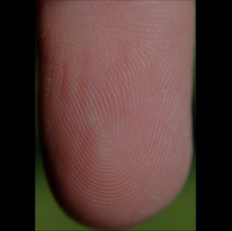
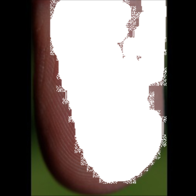
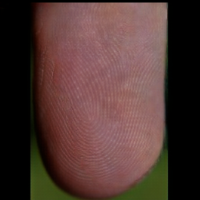

# EdgeConnect: Generative Image Inpainting with Adversarial Edge Learning
------------
Paper : [https://arxiv.org/abs/1901.00212](https://arxiv.org/abs/1901.00212)

Code : [https://github.com/knazeri/edge-connect](https://github.com/knazeri/edge-connect)

### Introduction
We use pre-trained Inpaint model trained with [CelebA](http://mmlab.ie.cuhk.edu.hk/projects/CelebA.html) data. The pretrained-model, which trained 2M iterations with CelebA data, was trained 1 epoch with fingerprint data.

## Fingerprint Inpainting pipeline
------------

  
  
  
  

